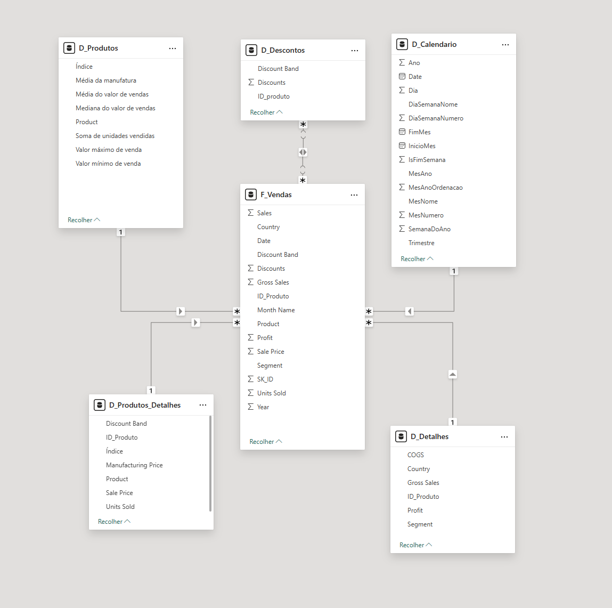

# 📊 Desafio de Modelagem de Dados - Financial Sample (Power BI)

Projeto desenvolvido como parte do **Bootcamp DIO - Modelagem de Dados com Power BI**, com o objetivo de aplicar os conceitos de **modelagem dimensional (Star Schema)**, **tabelas DAX** e **relacionamentos** entre tabelas fato e dimensões.

---

## 🧩 Estrutura do Projeto

A base utilizada foi a tabela **Financial Sample**, disponibilizada pela DIO, a partir da qual foram criadas as tabelas de **dimensão** e **fato** que compõem o modelo em estrela.

### 🔹 Tabela de Fato
**F_Vendas**
- Contém as informações de vendas: produto, unidades vendidas, preço, desconto, lucro, país, segmento e data.

### 🔹 Tabelas de Dimensão
**D_Produtos**
- ID_Produto  
- Produto  
- Média de Unidades Vendidas  
- Média, Mediana, Valor Máximo e Valor Mínimo de Vendas  

**D_Produtos_Detalhes**
- ID_Produto  
- Discount Band  
- Sale Price  
- Units Sold  
- Manufacturing Price  

**D_Descontos**
- ID_Produto  
- Discount  
- Discount Band  

**D_Detalhes**
- Informações complementares não contempladas nas demais dimensões (como Segmento, País, Lucro, etc.)

**D_Calendario**
- Criada **via DAX** com a função `CALENDAR()`, para servir como tabela de tempo no modelo.

---

## 🧮 DAX da Tabela `D_Calendario`

```dax
D_Calendario =
VAR MinData = MINX('F_Vendas', 'F_Vendas'[Date])
VAR MaxData = MAXX('F_Vendas', 'F_Vendas'[Date])
RETURN
ADDCOLUMNS(
    CALENDAR(MinData, MaxData),
    "Ano", YEAR([Date]),
    "MesNumero", MONTH([Date]),
    "MesNome", FORMAT([Date], "MMMM"),
    "MesAno", FORMAT([Date], "yyyy-MM"),
    "Trimestre", "Q" & FORMAT(QUARTER([Date]), "0"),
    "Dia", DAY([Date]),
    "DiaSemanaNumero", WEEKDAY([Date], 2),
    "DiaSemanaNome", FORMAT([Date], "dddd"),
    "IsFimSemana", IF(WEEKDAY([Date], 2) >= 6, 1, 0),
    "InicioMes", DATE(YEAR([Date]), MONTH([Date]), 1),
    "FimMes", EOMONTH([Date], 0),
    "SemanaDoAno", WEEKNUM([Date], 2),
    "MesAnoOrdenacao", YEAR([Date]) * 100 + MONTH([Date])
)
```

---

## 🔗 Relacionamentos do Modelo Estrela
| Dimensão                       | Relacionamento | Chave      |
| ------------------------------ | -------------- | ---------- |
| D_Calendario → F_Vendas        | 1 : *          | Date       |
| D_Produtos → F_Vendas          | 1 : *          | ID_Produto |
| D_Produtos_Detalhes → F_Vendas | 1 : *          | ID_Produto |
| D_Descontos → F_Vendas         | * : *          | ID_Produto |
| D_Detalhes → F_Vendas          | 1 : *          | ID_Produto |

---




## 🧠 Aprendizados e Conceitos Aplicados

Modelagem Dimensional (Star Schema)

Criação de tabelas DAX (CALENDAR, ADDCOLUMNS, VAR, RETURN)

Relacionamentos e cardinalidade

Organização de tabelas fato e dimensão

Ordenação de colunas com hierarquia de tempo

Funções de Inteligência de Tempo (YTD, QTD, YoY)

---


## 🚀 Autor

👤 Diego Marayo

🎓 Estudante de Engenharia de Software e entusiasta de Data Analytics

💼 Projeto desenvolvido para o Bootcamp DIO - Modelagem de Dados com Power BI

